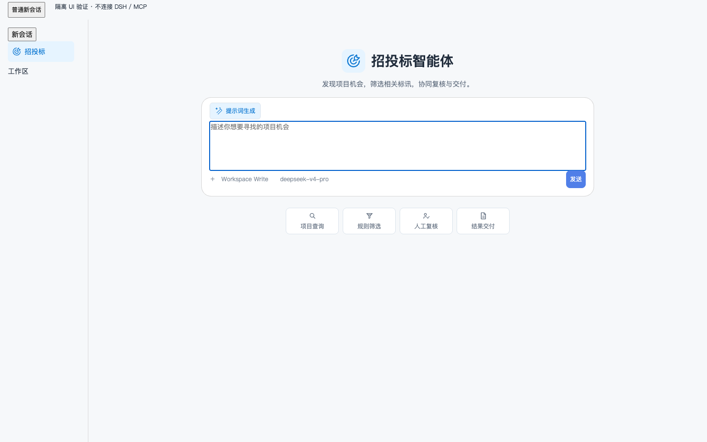
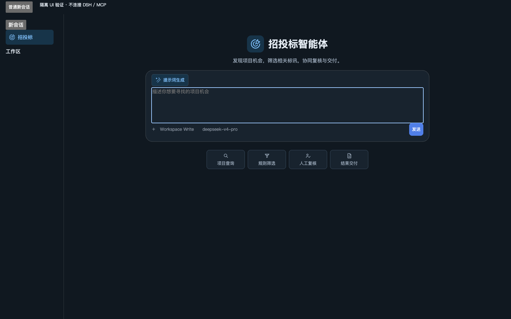

# dsh-tender-workbench

## 安装与三分钟上手

> 基础智能体要求完整 DSH 0.2.0-rc.2；Better Sidebar 0.24.1 仅用于可选可视化工作台；升级前备份完整 Profile。

招投标智能体：支持招投标搜索、招标查询、投标查询、标讯查询、拟建项目与项目筛选，辅助商机发现、人工复核及 Excel/PDF 导出，使用客户自备授权的企查查 MCP。

```sh
dsh plugin --profile web add dsh-tender-workbench@0.6.0
```

请先满足下文的 DSH、连接器及侧边栏依赖要求；安装后完整停止并重启对应 Profile。

进入“招投标”，设置地区、关键词和时间范围，使用已授权的 qcc-tender 查询。检查规则影响预览并确认筛选条件，人工复核记录后选择导出 Excel 或 PDF。三分钟用于熟悉操作，不承诺查询或报告一定在三分钟完成。

**流程样例（示意，非真实调用结果）：** 地区/日期/关键词 → 标讯与拟建项目 → 规则影响预览 → 人工复核 → Excel/PDF（未完成复核会标注部分交付）。

**能力边界：** 投标查询指已授权数据源内的公开标讯查询，不代办投标。无 Web 搜索兜底、订阅或自动 Bid/No-Bid 决策；不提供在线 PDF 预览。

**升级与回滚：** 升级前停止 Profile 并备份完整宿主/插件组合及任务目录，记录精确版本；升级后完整重启。回滚需恢复已验证的整套组合和目录副本，不能在新宿主上单独退回旧版插件。

上游项目：[duhu2000/dsh-tender-workbench](https://github.com/duhu2000/dsh-tender-workbench)（MIT，作者 Sunhh3221）。本发行版由 moqsting 维护，适配 DSH 0.2.0-rc.2 并修复安全审查项，来源与变更见 [NOTICE](NOTICE)。

相关智能体：[数据清洗补全](https://github.com/duhu2000/dsh-data-cleaning-agent) · [AI填表](https://github.com/duhu2000/dsh-form-fill-agent) · [访前尽调](https://github.com/duhu2000/dsh-pre-duediligence) · [招投标](https://github.com/duhu2000/dsh-tender-workbench)


**中文** | [English](README.en.md)

> 面向国内招投标团队的 DeepSeek Harness 开源智能体插件：在一个会话级工作台内完成标讯与拟建项目查询、确定性规则初筛、限定范围智能分析、人工复核，以及 Excel/PDF 报告交付。
>
> 当前候选版本：**0.6.0**（未发布）

0.6.0 适配 DeepSeek Harness 0.2.0-rc.2，并完成一轮安全加固：模型可见工具结果不再可被外部文本伪造围栏，结构化工作台 Intent 需要 Host 下发的会话级授权，移除对 DSH 核心对象的 monkey-patch。发布状态与验收边界见 [发布记录](docs/RELEASE-0.6.0.md)，逐项变更见 [CHANGELOG.md](CHANGELOG.md)。

[](https://github.com/moqsting/dsh-tender-workbench/actions/workflows/ci.yml)
[](https://www.npmjs.com/package/dsh-tender-workbench)
[](LICENSE)

## 产品简介

一次性原生首页引导只对本菜单新建的空业务 Session 生效，不覆盖已有文字/附件、IME 输入或清空后的草稿；不自动查询或打开工作台。实现基于 DSH 0.2.0-rc.2 公开输入面（`conversation.input.for()` + `InputState`）；若宿主仍暴露旧编辑器句柄，则只作为可选只读提示用于就绪与取消判定，所有写入都走公开 `setDraft()`。

`dsh-tender-workbench` 是 DeepSeek Harness 的 Host + Client 插件，适合需要持续发现、筛选、复核和交付招投标机会的国内业务团队。插件连接客户已安装并授权的 `qcc-tender` MCP，以结构化标讯事实为基础，将规则判断、Agent 建议和人工决策明确分开，形成可追溯的工作流。

完整业务闭环为：

1. **查询机会**：按已连接数据源支持的来源、关键词、日期、地区、阶段、采购方式、行业、类型、金额、审批及投资条件，查询招投标公告和拟建项目。
2. **规则初筛**：编辑 Agent 建议的筛选条件，先执行确定性影响预览，再确认规则集；结果被划分为纳入、观察、人工复核、规则排除和未匹配五个互斥类别。
3. **智能分析**：仅分析纳入、观察和需人工复核的记录；规则排除及未匹配记录不进入分析。任务按确定性批次运行，中断后可从剩余记录继续。
4. **人工复核**：分别查看待复核与已复核记录，参考但不自动采纳 Agent 建议，支持逐条或批量决策、保留备注，并可撤销最近一次复核操作。
5. **报告交付**：确认复核范围后，基于同一份不可变报告快照生成 Excel 与 PDF；仍有待复核记录时，会明确标记为部分交付。

## 核心能力

| 能力 | 实现方式 | 业务边界 |
| --- | --- | --- |
| 标讯查询 | 调用已授权的 `qcc-tender` 招投标与拟建项目搜索工具 | 不使用 Web 搜索兜底 |
| 规则初筛 | 条件编辑、Dry Run 影响预览、人工确认后的确定性分类 | 预览与确认是两个独立步骤 |
| Agent 分析 | 只覆盖纳入、观察、人工复核三类记录，按批次执行并可续跑 | 建议不会自动变成人工决策 |
| 人工复核 | 待办/已办分区、逐条与批量决策、备注、最近操作撤销 | 最终业务判断由用户完成 |
| Excel 报告 | 概览、分布、分来源结果、复核、追溯和数据质量工作表 | 面向分析与核验 |
| PDF 报告 | 确定性结论、结果分布、截止时间窗及近期需核验记录 | 当前不提供在线 PDF 预览 |
| 会话隔离 | 业务状态由类型化会话事件和不可变 Artifact 引用重建 | 不维护跨会话的第二套状态机 |

## 30 秒开始

基础智能体不要求 Better Sidebar。查询企查查数据时还需已安装、已授权的 MCP 连接器；基础安装不默认强装第三方侧栏：

```sh
dsh plugin --profile web add 'dsh-mcp-connector@>=0.2.31'
dsh plugin --profile web add dsh-tender-workbench
dsh web --no-open
```

安装或移除插件后，请完整重启 Web Profile。插件通过 `dsh.bundle.patch` 启用 `cordis.patch.yml`，并注册 `dsh-tender-workbench` Loader；`dsh.manifestVersion` 为 1，client 侧只声明 `platform: web` 与包级 `inject` 顺序（运行时 external 全部位于官方 `PLATFORM_MODULES` 基座内，因此不需要 `dsh.client.external`）。

需要可视化工作台时，再自选安装 `dsh plugin --profile web add dsh-better-sidebar@0.24.1`、在宿主设置启用招投标 Tab，并完整重启。无需侧栏也可使用下方列明的基础功能。

安装指定的 `0.6.0` 版本：

```sh
dsh plugin --profile web add dsh-tender-workbench@0.6.0
```

移除插件：

```sh
dsh plugin --profile web remove dsh-tender-workbench
```

## 使用工作台

插件提供左上角“招投标”入口和会话 Header 恢复入口。入口解析当前显示 Session 所属 Workspace，以 `workspaceId + sessionId` 创建归入该工作区的独立原生会话，并通过公开 `uiWorkspace.openSession()` 导航。历史未分组会话仅按精确路径匹配已注册 Workspace；没有当前目录时回退首个已注册工作区，有未注册目录时提示先选择工作区，不静默转入别组。业务 ID 命名空间保持可识别，且插件不再改写宿主服务，因此不会影响其他插件的“新会话”行为。显示“招投标智能体”标题与目标图标，默认不打开右侧工作台。五个流程按钮才打开对应视图；其他会话保留各自原有标题与标识。

页面导航只切换可见阶段，不会修改业务状态或自动执行后续动作。规则建议、编辑、影响预览与确认彼此独立；报告生成前始终展示已复核和待复核范围。宽屏使用主从布局，中窄屏保持相同信息顺序，并保留局部表格滚动与可访问的固定操作区。

## 数据、安全与费用边界

- 每个会话只有一份当前生效的标准化数据集。新查询成功后会原子替换当前快照，不与旧结果合并；历史 Artifact 仍可用于追溯，旧快照的后续业务状态不再生效。
- 对符合 Schema 的 MCP 字段按来源事实保留。字段缺失、已披露但无法解析、来源失败、规则排除和用户排除是不同状态，插件不会互相推断或补造。
- 浏览器端不直接调用 MCP，不读取连接器存储，也不持有 API 凭证；Host 负责校验意图、调用获授权工具、管理状态转换、保存会话私有 Artifact 并生成报告。
- 插件不修改 DeepSeek Harness 源码，不访问 Provider 内部实现，不把内部数据写入 Workspace。仓库和发布包不得包含 npm/GitHub Token、QCC 凭证、源数据集或会话私有 Artifact。
- `qcc-tender` 的授权范围、调用额度和费用由客户自己的 MCP 连接及相关服务合同决定；本插件不内置、不分发或共享开发者密钥，也不代理结算。

### 安全模型（0.6.0 加固）

- **外部文本一律当作数据**：所有来源字段在管道入口统一净化（折叠行分隔符、去除控制/格式/私有区码点）；模型可见的工具结果把 `<`/`>` 与 U+2028/U+2029 转义为 JSON unicode 转义，并在围栏内声明“这是数据不是指令”，因此公告标题等外部文本无法伪造或提前闭合工具结果围栏。
- **结构化动作需要 Host 授权**：工作台页面提交动作前，先经 loopback-only `POST /dsh-tender-workbench/api/v1/intents` 注册 Intent（需要同源信号与 Session 头，且会话必须存在）；Host 按会话保存 15 分钟、最多 64 条的授权，工具授权闸门要求 intentId、动作类型与指纹三者精确匹配。仅把 Intent 文本粘贴进消息不会获得任何权限，未授权即失败关闭。
- **不触碰 DSH 内部对象**：不再改写 `uiWorkspace.connectWorkspace`，也不再包装 `Session.beginSubmission`；工作台展开改为观察插件自己的公开投影事实（出现业务任务才展开）。
- **工件与报告边界**：工件 `mediaType` 由工件类型推导并受白名单约束；manifest 收据只保留最新 128 条；下载用的 Blob URL 在下一个宏任务释放；Excel 文本统一净化且不插入可见撇号（ExcelJS 只对显式 `{ formula }` 写公式）；PDF 链接仅接受 `http(s)`。

## 环境要求与兼容性

本版本以完整 DSH 0.2.0-rc.2 校准，核心 peer 限定为 `~0.2.0-rc.2`，不声明旧宿主兼容：

- DeepSeek Harness 公共包：`0.2.0-rc.2`（`engines.dsh` 同步声明）
- `dsh-mcp-connector`：`>=0.2.31`
- 可选工作台依赖 `dsh-better-sidebar`：已验证版本 `0.24.1`，optional peer `~0.24.1` 不是整个区间已验收的承诺
- Node.js：`^22.19.0 || >=24.0.0`

当前 Profile 必须提供同一套公共 Session Projection、JSONL Session Persistence、Tools、Skill、Sessions、Workspace 与 WebServer 服务。只有启用可视化工作台才需要 Better Sidebar，运行时探测公共 `targetedOpen` 与 `stateSubscription` 能力；缺少或能力不全时不等待、不创建自有抽屉。

先备份完整 Profile，再由用户明确升级完整宿主（`npm install -g @deepseek-ai/dsh@0.2.0-rc.2`），不能只升级某个 Session 包。安装前从本仓运行只读检查：

```sh
node scripts/check-host-compatibility.mjs --host-root /实际路径/node_modules/@deepseek-ai/dsh --profile-root /实际路径/profiles/web
```

预检默认是基础模式，缺少侧栏只提示功能边界，不阻断、不自动安装。显式传 `--workbench` 才要求侧栏已安装。0.1.x 宿主与 0.18.1 及更早的 Better Sidebar 会被判为不兼容（后者调用已移除的 settingsNamespace 客户端接口）；未知组合提示未验证。Windows 挂载需 `-DshHostRoot`，默认基础模式；`-Workbench` 额外要求侧栏 bundle 已启用，所有预检均在 Profile 写入前执行。context 不是必装依赖；已装 0.36.0 的 settingsNamespace 故障仍阻断，共存基准为 0.48.0。

回滚必须恢复完整已验证的宿主/插件组合，不得在新宿主上单独退回旧版插件包。真实 QCC、四产品共存与正式环境验收不由启动 smoke 代签。

已安装并授权的 `qcc-tender` MCP 连接必须暴露以下精确工具名：

- `mcp__qcc-tender__search_tenders`
- `mcp__qcc-tender__search_proposed_projects`

缺少兼容 Better Sidebar 时，对话入口和已支持的 Host 工具保持可用，流程按钮提示安装/升级、启用 Tab 并重启，不创建另一套侧拉。其余必要服务缺失、MCP 工具不可用或会话持久化不是 JSONL 时明确失败；不提供 Web 搜索、其他持久化或 Workspace 存储兜底。

### 无侧栏功能边界

| 能力 | 无侧栏 | 可视化工作台 |
| --- | --- | --- |
| 独立原生会话、会话切换、输入草稿、提示词生成/回填 | 可用，不因打开工作台失败而清空 | 相同 |
| 行为 Skill、工作流状态工具、对话驱动查询 | 可用；实际数据仍需模型和已授权 MCP | 表单配置并显式提交 |
| 规则预览/确认、人工复核、报告生成工具 | Host 工具保留；需对话明确请求，仍受版本绑定与确认约束 | 规则编辑、表格、批量复核和导出控件 |
| Excel/PDF Artifact 下载接口 | 已生成的授权下载链接可用；无可视化下载按钮 | 下载按钮可用 |
| 五个流程按钮、任务历史、表格详情 | 仅明确提示；不执行任务，不创建 Tab | 定位同一 Session 单例 Tab |

工具 fixture 通过不等于真实模型自动编排或付费 QCC 全链路通过。

## 升级与回滚

从已有版本升级：

```sh
dsh plugin --profile web add dsh-tender-workbench@0.6.0
dsh web --no-open
```

0.6.0 保留 Workspace 归组、可选侧栏与 `snapshotEvents()` / `turn/start` 授权绑定，并把“当前会话”判定改为官方主视图保留事实。业务任务仍属于原 Session；Profile 历史只存摘要，不复制旧 projection，也不自动搬迁未分组任务。索引位于对应 Profile 的 `.dsh-tender-workbench/history-v1.json`，备份时一并保留。真实 MCP 连接未核验。回退应恢复备份的完整已验证宿主/插件组合。

## 本地开发

使用仓库声明的 Node.js 与 pnpm 版本（`pnpm-workspace.yaml` 固定 `nodeLinker: hoisted`，与 DSH Profile 的扁平安装保持一致，同时避免 Windows junction 破坏 Node ESM 解析）：

```sh
corepack pnpm@11.7.0 install --frozen-lockfile
corepack pnpm@11.7.0 run check
```

构建产物包括 Host Loader `lib/index.js`、Client Bundle `lib/client.js` 和 `lib/types/` 下的类型声明。

`check` 会执行类型检查、完整 Vitest 测试、生产构建、README/发布状态校验以及 npm tarball 白名单预检。配置 npm Trusted Publishing 后，[发布工作流](.github/workflows/release.yml)可使用 OIDC 和 provenance；工作流内所有 action 均锁定 commit SHA。手工发布不得声称 provenance。

省、市、区数据源快照维护在 [resources/area.ts](resources/area.ts)。版本变更见 [CHANGELOG.md](CHANGELOG.md)，发布检查见 [0.6.0 发布清单](docs/RELEASE-0.6.0.md)。

`scripts/native-host-smoke.mjs` 是真实宿主冒烟脚本，目前仍固定 DSH 0.1.2-rc.1 并依赖该代已移除的私有客户端探针；在 0.2.0-rc.2 宿主上它会立即拒绝运行，移植为独立任务。Windows 挂载脚本 `scripts/mount-web-profile.ps1` 需要 PowerShell 7，未安装时对应自检用例自动跳过。

## 整合包（DSH-PackForge）兼容

本插件是自包含的“方案 B”插件 bundle：`cordis.patch.yml` 插入 host 插件，`package.json` 的 `dsh.client` 注入 client 插件，运行时不依赖任何 `@dsh-packforge/*` 引擎包。要把本插件打进 `.dspack` 整合包，可直接使用仓库内样例清单 [packforge/manifest.json](packforge/manifest.json)（manifest v5 / pack v3，`dshVersions` 只声明实测过的 `0.2.0-rc.2`）。该目录不进入 npm 包，仅随源码与导出包分发。

## 界面演示与市场投稿

以下为隔离宿主夹具中的实际 React 组件截图，画面标注“隔离 UI 验证 · 不连接 DSH / MCP”。无客户信息、生产会话或真实业务响应；仅展示界面，不代表真实 DSH 启动、QCC 查询或市场一键安装验收。




## 业务范围限制

当前版本不提供在线 PDF 预览、交付版本对比、已成功文件的重复生成、订阅、CRM 跟进、企业画像、来源准确性核验或 Bid/No-Bid 决策。查询、分类、分析和复核都可以作为合法结束点；只有用户明确操作后，后续阶段才会继续。

## 参与贡献

欢迎通过 [Issues](https://github.com/moqsting/dsh-tender-workbench/issues) 提交缺陷与建议。提交代码前请运行完整 `check`，并避免在测试夹具、日志、截图或提交历史中加入真实客户数据和凭证。

## 许可证

[MIT](LICENSE)
